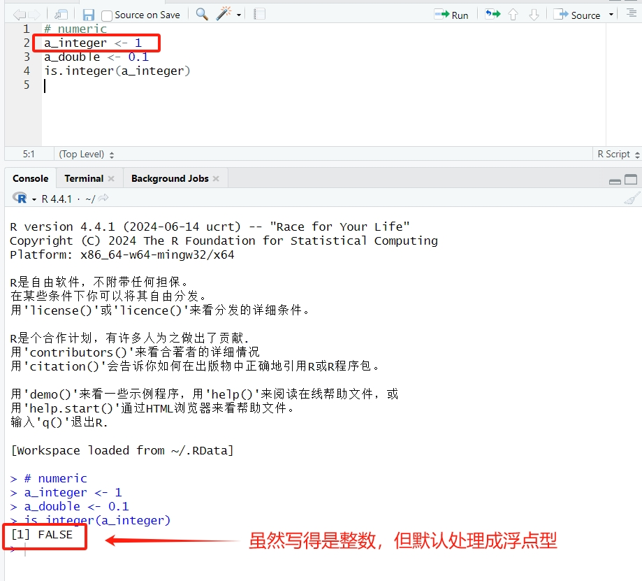
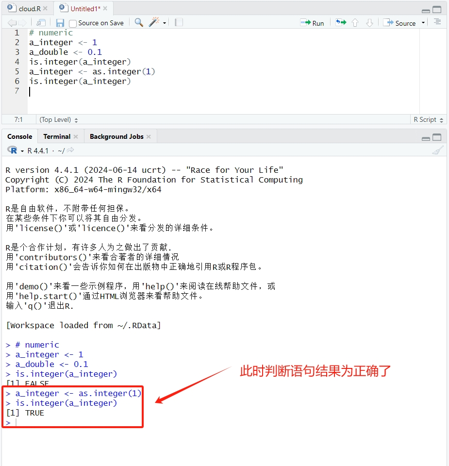
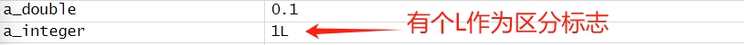
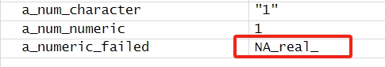
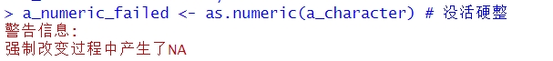

# 数据类型

## 单维数据类型

单维数据类型包括**数值型、字符型**和**逻辑型**三种。

### Numeric(数字型)

#### 一般理论

分为整型和浮点型，分别代表着整数和小数。

因此有一个重要的问题：

> 赋值语句是没有是否为整型的，那假如编程者赋值了一个**人类视角下的整数**，程序又将如何处理呢？
>
> R语言采用的是**尽量避免脚本报错**的思路，往兼容性更高的类型上发展。

因此如果没有刻意说明，数据刚赋值时**默认为浮点型**!

整型需要人们手动去指定，使用一些方法去说明，好在R语言已经提供了相关的接口可供调用。

~~~R
# 整型integer
a_integer <- as.integer(1) # 这个没有省略方法(?)
is.integer(a_integer) # integer类型判定
# TRUE
~~~

此时R语言引擎就承认这是一个整型变量了。

实际上R语言在整型和浮点型的存储上也有区分，整型会专门加一个"L"作为标志

万一遇到了其他的数据类型，R语言也为浮点型double提供了判别方法

~~~R
# double类型
a_double <- 0.1 # 一般默认是这样的
a_double <- as.double(0.1) # 不放心可以这样
is.double(a_double) # double类型判定
# TRUE
~~~

---

#### 特殊处理措施

1. 当R语言在读取**表格中一行/列的值**时，如果全是**人类视角下的整数**，R语言会自动将这一行/列的值**全部视为整型**。

### Character(字符串型)

#### 一般理论

类型即为字符串，一般会使用**引号**作为标志，**不区分单、双引号**。

~~~R
# 字符串型character
a_character <- "Hello, world!"
a_num_character <- "1" # 只要加了引号,那就是字符串型
is.character(a_character)
# TRUE
is.numeric(a_num_character)
# FALSE
is.character(a_num_character)
# TRUE
~~~

一般的字符串就这样了，但是以示例代码中的a_num_character为例，它在人类的视角下可以被视为一个**加了引号的数字型**，那我们可以实现相关的方法，使得这样的值可以进行**跨大类型转换**。

~~~R
# character -> numeric
a_num_character <- "1"
a_num_numeric <- as.numeric(a_num_character) # 如果成功，那a_num_numeric中可以看到对应的字符串
is.numeric(a_num_numeric)
# TRUE
# 万一转换失败了呢?
a_character <- "Hello, world!"
a_numeric_failed <- as.numeric(a_character) # 没活硬整
is.numeric(a_numeric_failed)
# TRUE
~~~

然而这个结果出乎意料，虽然中途没活硬整出现了报错，但此时对numeric的检验函数依旧显示结果为TRUE!这种不合逻辑的行为可就让人头疼了。

那这个时候a_numeric_failed是什么类型呢？答案是NA_real_。

而报错信息其实也会提醒你产生了这种奇葩类型。

到此，字符串本身就讲完了，接下来就是它的一些使用方法。从“串”字就可以看出这个数据类型应该要有可以拼接，可以“串”起来的方法

~~~R
# paste && paste0

# paste 方法可以将两个字符串通过确定的分隔符相连接，分隔符用sep指定
# 分隔符的数据类型也是字符串
paste("Hello_world", "123", sep = ".")
# "Hello_world.123"

# paste0 方法可以将多个字符串从左往右按顺序拼接起来，间隔符指定为空格
paste("Hello_world", ".", "123")
# "Hello_world . 123"

# 相比较之下, paste0简单易实现, paste更加定制化
~~~

既然字符串可以拼接，那自然也得有分割之法。

~~~R
# substr

# substr 方法可以将字符串指定范围内的字符提取出来，作为一个新的字符串返回
# 通过start和stop确定分割范围的首尾
# 规定字符串的第一位序号为0
substr("Hello_world", start = 0, stop = 1)
# "H"
# start对应的序号可以取到，但是stop处对应的序号不会取到，是左闭右开区间
substr("Hello_world", start = 2, stop = 5)
# "ello"
~~~

### Logical(逻辑型)

#### 一般理论

这种类型只有两种值，TRUE和FALSE，这二者有时可以用T或者F去取代

不过，这也可以用0和1去转换，0对应FALSE，1对应TRUE

~~~R
# Logical
a_logical <- TRUE
is.logical(a_logical)
# TRUE
a_numeric <- 1
a_numeric <- as.logical(a_numeric)
is.logical(a_numeric)
# TRUE
a_numeric
# TRUE
~~~

